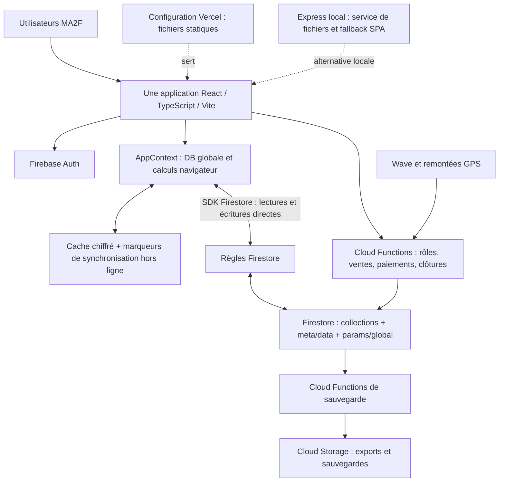
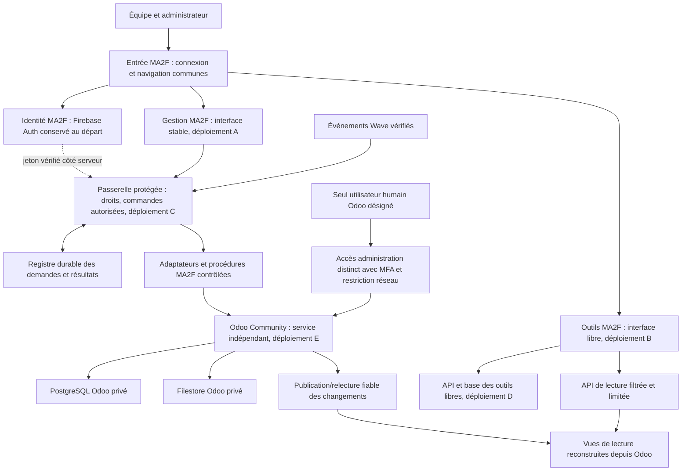

# Audit de transition MA2F vers Odoo Community

Date : 7 septembre 2026. Périmètre exclusif : MA2F, eau en sachets.

Actualisation : voir [la carte Community des 37 rubriques](MA2F-COMMUNITY-CAPABILITY-MAP.md)
pour les décisions et l'état vérifié ultérieurs. Ce document conserve les constats
historiques ; ses hypothèses sur Firebase, les unités et les tests ne décrivent
pas toutes la cible actuelle.

## 1. Décision proposée et portée de l'audit

Conserver MA2F comme expérience utilisateur et transférer les opérations officielles vers Odoo Community. Séparer l'interface de gestion stable de l'espace expérimental, en plus de séparer les serveurs et bases. Un seul utilisateur humain désigné accède directement au back-office Odoo ; le personnel utilise la gestion MA2F. Les identités techniques d'intégration sont distinctes de cet utilisateur.

Audit statique du dépôt local au commit `4e641ea292e012449428793350aafe1336996927` : 37 entrées de navigation, composants métier, types, calculs, synchronisation, règles Firestore, Cloud Functions, sauvegardes et configuration de déploiement. Vérification complémentaire du code public Odoo, branche `19.0`.

Cet audit n'est ni un contrôle de la base de production, ni un test d'intrusion, ni une recette comptable. Aucun accès aux données métier réelles, aucune installation Odoo et aucun test d'exécution de l'application n'ont été effectués. Les déploiements réellement actifs, les soldes, les volumes, les accès et les comportements en exploitation restent à vérifier. Les documents d'audit historiques du dépôt ne sont pas considérés comme preuve de l'état de production actuel.

Le présent livrable décrit une cible et les impacts ; il ne réalise aucune migration. L'existence d'un module Community ne garantit pas que chaque procédure MA2F est couverte sans adaptation.

## 2. Constats prioritaires dans le code actuel

| Priorité | Constat vérifié et preuve | Conséquence pour la migration |
|---|---|---|
| Haute | La création d'une vente continue après un refus/échec de validation Cloud Function ; le navigateur complète ou crée la vente et son mouvement de stock. `VentesSection.tsx:310–377`, `cloudFunctions.ts:237`. | Un refus métier serveur doit bloquer la validation. Une coupure laisse une demande en attente ; aucune vente officielle parallèle dans Firebase. Les règles Firestore actuelles apportent des contrôles, mais ne remplacent pas l'opération métier complète. |
| Haute | `saveToFirestore()` construit plusieurs `setDoc`/`deleteDoc`, puis attend `Promise.all`. Des listes restent dans `meta/data`. `AppContext.tsx:74,724,829,842,950,979`. | Une vente et ses effets ne sont pas une transaction globale par ce chemin. Retirer ce mécanisme pour les domaines Odoo ; conserver des commandes métier limitées, avec résultat explicite. |
| Haute | La caisse additionne ventes, recouvrements, apports et solde d'ouverture ; elle soustrait dépenses, versements et certains coûts véhicule/maintenance. Le dédoublonnage compare notamment date, montant et catégorie. `helpers.ts:134–171`. | Remplacer les rapprochements implicites par des références de pièces. Distinguer caisse physique, fonds détenus par livreur, banque et mobile money. Les soldes ne seront plus recalculés depuis des copies d'écrans. |
| Haute | `computeStockMatierePremiere()` recalcule toute la consommation depuis le rendement courant ; les mouvements de production stockent la consommation calculée lors de la saisie. `helpers.ts:197`, `ProductionSection.tsx:262`. | Un changement de rendement peut faire diverger ces vues. Odoo doit conserver la consommation réelle et la nomenclature/version applicable à chaque fabrication. |
| Haute | Les rebuts sont décrits comme des sachets dans le type Production, alors que leur mouvement utilise `sachet_plein`, dont l'unité est le pack. Les ratios ajoutent packs et rebuts. `types.ts:10`, `ProductionSection.tsx:72,267`, `stock.ts:275,407`. | Incohérence de sens/unité à trancher sur des exemples réels avant import. Confirmer aussi si « packs produits » représente une quantité brute ou conforme, pour ne pas déduire deux fois les rebuts. Aucun historique ne doit être converti automatiquement sur une supposition. |
| Haute | Le webhook Wave lit le statut puis écrit un recouvrement à ID aléatoire avec un batch ; lecture et décision ne sont pas dans une transaction. `cloud-functions/src/index.ts:1012–1068`. | Deux callbacks simultanés peuvent passer le même contrôle. Prévoir unicité de la référence fournisseur et de l'opération, transaction locale et reprise après timeout sans double paiement. Présence du code confirmée, fonctionnement en production non vérifié. |
| Moyenne | `updateEntity()` lit la version puis appelle `updateDoc`, hors transaction. `firestoreService.ts:121–157`. | Ce contrôle de version n'est pas une garantie de concurrence atomique. Ne pas le reprendre tel quel pour le connecteur critique. |
| Haute | Le mode hors ligne courant enfile un marqueur de sauvegarde, puis renvoie l'état local global à la reconnexion. `AppContext.tsx:1002–1078`. | Construire une file de demandes métier durables avec données, auteur, identifiant et dépendances. Revalider droits, état et période au moment du traitement. |
| Moyenne | Les ventes référencent souvent client, commercial et livreur par nom ; `Commande.clientId` et `Recouvrement.venteId` sont optionnels. `types.ts:29,84,252`. | Détecter homonymes, doublons et relations manquantes. Table de correspondance stable identifiant MA2F ↔ identifiant Odoo ; aucun rapprochement automatique uniquement par nom. |
| Haute | L'export comptable produit les écritures depuis les tableaux de l'application ; les achats passent par les dépenses payées, et la commission peut être traduite directement en sortie de caisse. `exportComptable.ts:103–219`. | Reprise contrôlée avec le comptable : dette fournisseur, charge, commission due et paiement doivent être distingués. Ne pas importer ces exports comme une comptabilité exhaustive sans rapprochement. |
| Moyenne | `package.json` n'a pas de commande de test ; `tests-calculs.ts` fournit des vérifications sur les données à l'exécution. Aucun fichier de test automatisé dédié trouvé dans l'inventaire. | Avant bascule, tests indépendants de résultats attendus, concurrence, droits, retours et reprise. Le contrôle de types n'a pas été exécuté dans cet audit ; aucun nombre d'erreurs actuel n'est affirmé. |

### Particularités à préserver

- « Livraisons » (`Livraison`) représente les réceptions de rouleaux fournisseurs en kg, et non les livraisons aux clients.
- « Versements » correspond aujourd'hui à des sorties de caisse vers un bénéficiaire. Ne pas les convertir globalement en remises des livreurs.
- Les mouvements d'actionnaires constituent volontairement un registre informatif sans effet sur la caisse ; leur import ne doit pas déclencher des paiements ni doubler des apports existants.
- Les employés ne constituent pas une paie : le salaire de référence est informatif et les paiements sont saisis dans Dépenses.
- L'affichage Production multiplie les packs par 30. Cette convention du code doit être confirmée avec l'usine et remplacée par un conditionnement explicite, sans réinterpréter les rebuts historiques.
- Les noms de clés de stockage historiques doivent être migrés avec lecture de compatibilité si on les renomme ; un renommage brutal ferait perdre l'accès aux saisies locales.

## 3. Matrice complète des 37 écrans

**O** : Odoo propriétaire des données officielles. **P** : procédure MA2F protégée, côté serveur et revue/testée, utilisant Odoo. **L** : outil libre, sans pouvoir autonome sur le stock ou l'argent. Un écran peut combiner plusieurs responsabilités, à séparer dans son implémentation.

| Écran / identifiant | Aujourd'hui | Cible et effet concret pour l'utilisateur | Traitement |
|---|---|---|---|
| Tableau de bord `dashboard` | Agrégations depuis DB dans le navigateur. | Chiffres officiels lus d'Odoo via vues autorisées ; date de fraîcheur visible. Simulations visuellement séparées. | O pour les chiffres, L pour les visualisations. |
| Production `production` | Quantité de packs, consommation estimée par rendement, rebuts, machine et producteurs ; mouvements créés localement. | Déclaration simplifiée liée à un ordre de fabrication, lots, quantités conformes, consommation et rebuts avec unités. « Validé » seulement après succès serveur. | O : `mrp`, `stock`, dates ; P : attribution à plusieurs producteurs si nécessaire. |
| Ventes `ventes` | Une ligne combine vente, crédit, avance, bonus, commercial et livreur ; sortie de stock associée. | Un écran peut rester simple, mais génère des pièces reliées : commande, livraison, facture, paiement éventuel. Bonus consommant réellement le stock, règles tarifaires contrôlées. | O : `sale_management`, `sale_stock`, `account` ; P : exceptions/bonus. |
| Commandes `commandes` | Carnet d'appels avec affectation et statuts ; lien manuel vers vente. | Commande Odoo centrale ; heures d'appel et de livraison conservées en champs métier. Livraison partielle et annulation suivies sans recréer une vente indépendante. | O + P pour les événements terrain. |
| Clients `clients` | Fiches, prix, zone, GPS, plafond de crédit et bonus spécifiques. | Contact Odoo référent et ID stable ; prix officiels paramétrés ; carte MA2F conservée. Limite de crédit à définir comme avertissement ou blocage serveur. | O : contacts/tarifs ; P : limite et bonus ; L : carte. |
| Commerciaux `commerciaux` | Fiches, objectifs et commissions calculées sur ventes. | Identité reliée à Odoo ; commissions calculées selon une règle versionnée, avec distinction montant dû/paiement. Objectifs restent personnalisables. | O + P commissions + L objectifs. |
| Livreurs `livreurs` | Fiches, camion affecté, capacité en packs et objectifs. | Conducteur/véhicule reliés ; transferts et livraisons Odoo. Historique d'affectation pour qu'un changement de camion ne réécrive pas une tournée passée. | O : `fleet`, stock ; P affectation/tournée. |
| Producteurs `producteurs` | Fiches et saisie rapide de production, contributions aux lots. | La saisie rapide utilise exactement la même commande serveur que Production. Attribution des contributions préservée, sans seconde création de stock. | O + P contribution collective. |
| Employés `employes` | Liste de salariés et salaire informatif, lien aux dépenses. | Référentiel `hr`, écran MA2F possible. Le calcul de paie locale n'est pas promis par cette migration. | O : `hr` ; paie hors premier lot. |
| Actionnaires `actionnaires` | Registre et mouvements informatifs séparés de la caisse. | Conserver cette sémantique. Toute comptabilisation future devient une action explicite rapprochée d'une pièce existante, pas un effet automatique d'import. | L pour registre restreint ; P/O si comptabilisation décidée. |
| Dépenses `depenses` | Catégories, montants, bénéficiaires, salaires, budgets et approbation. | Distinguer facture fournisseur, note de frais, paiement et avance. `hr_expense` seulement pour frais des salariés. Budgets visibles dans MA2F ; approbation effective serveur. | O : `account`, `purchase`, `hr_expense` ; P contrôles. |
| Caisse `caisse` | Solde calculé par additions/déductions de plusieurs tableaux. | Soldes par journal et détenteur depuis les pièces officielles. Remise du livreur = transfert de fonds déjà encaissés, sans nouvelle recette. Le fonds initial est une ouverture validée. | O + P procédures de caisse. |
| Créances `creances` | Reste calculé depuis vente/avance/recouvrements ; possibilité d'encaisser. | Restes dus sur factures et paiements affectés ; saisie d'encaissement par le même service que Recouvrement. Anciennes créances sans facture traitées en reprise validée. | O : `account`. |
| Recouvrement `recouvrement` | Paiements reliés à une vente/BL, parfois lien absent. | Paiement avec référence unique et affectation explicite à une ou plusieurs factures ; suivi des trop-perçus/non-affectés. | O + P connecteurs de paiement. |
| Livraisons `livraisons` | Réception de rouleaux : kg, prix, cash/crédit, contrôle qualité et dépense liée. | Renommer idéalement « Achats et réceptions ». Séparer commande fournisseur, réception acceptée, lot, facture et paiement. Rejet fournisseur n'est pas une vente perdue. | O : `purchase_stock` ; P contrôle qualité si blocage requis. |
| Maintenance `maintenance` | Intervention, coût, arrêt machine, perte estimée et dépense créée. | Équipement/demande dans Odoo ; coût relié à facture ou note de frais, pas dupliqué. Pertes estimées restent analytiques. | O : `maintenance`, `account` ; L analyses. |
| Versements `versements` | Sorties de caisse, type et bénéficiaire. | Classer chaque type : paiement d'une dette/commission, transfert, avance, autre sortie. Retirer le mécanisme de simple déduction globale. | O + P qualification et autorisation. |
| Apports `apports` | Entrées hors ventes ajoutées à la caisse. | Enregistrement du financement et du paiement avec compte de contrepartie validé ; lien à l'associé si pertinent et pas de duplication du registre Actionnaires. | O : `account` + P formulaire. |
| Analytique `analytique` | Estimations de coûts et répartitions paramétrées. | Séparer coût réel issu des pièces/valorisations et hypothèses. Afficher méthode, période et unités ; une simulation ne modifie aucune nomenclature officielle. | O pour réalisé, L pour scénarios. |
| Véhicules `vehicules` | Fiches, opérations carburant/entretien, dépenses liées, GPS. | `fleet` pour véhicule/coûts ; pièces financières reliées. Positions GPS restent hors Odoo sauf référence utile ; association historique à la tournée. | O + P coûts + L télémétrie. |
| Corbeille `corbeille` | Suppression/restauration de lignes et parfois mouvements liés. | Pour les documents validés, actions de retour, avoir, extourne ou archivage selon le type. Les brouillons peuvent suivre une suppression autorisée. Pas de restauration brute d'un paiement. | O/P pour gestion ; L pour données purement libres. |
| Rapport `rapport` | Totaux/exports depuis les tableaux locaux. | Rapports filtrés sur données officielles ; export avec période, filtres et fraîcheur. Historique ancien étiqueté et non additionné aux soldes repris. | O pour source, L présentation. |
| Journal `journal` | Entrées d'activité venant du client, plus audit serveur séparé. | Vue unifiée des opérations avec auteur vérifié, identifiant de demande, document Odoo et résultat. Un journal client seul ne fait pas preuve d'une validation. | P journal serveur. |
| Sécurité `securite` | Contrôles et mécanismes de sécurité applicatifs/Firebase. | Accès Odoo nominatif unique, authentification forte, accès réseau séparé, permissions par commande ; aucune clé Odoo dans le navigateur. | P/infrastructure. |
| Sauvegardes `backups` | Exports et sauvegardes Firestore JSON/Excel dans Cloud Storage, restauration applicative. | Sauvegarder PostgreSQL Odoo ET filestore, configuration/extensions ; sauvegarder MA2F et registre d'intégration séparément. Restaurations testées et rapprochées. Excel reste un export, pas la sauvegarde Odoo. | Exploitation protégée. |
| Utilisateurs `utilisateurs` | Firebase Auth, profils et claims ; rôles admin/caissier/commercial/lecteur. | Firebase Auth peut rester pour MA2F. Séparer le droit « administrer MA2F » du droit « ouvrir Odoo » lié au seul UID désigné. Acteur humain transmis par le serveur, jamais choisi librement par le client. | P identité et droits. |
| Paramètres `parametres` | Rendement, tarifs, commission, ouvertures, budgets et références regroupés. | Répartir : articles/unités/nomenclatures/taxes Odoo ; commissions et seuils protégés ; préférences d'affichage MA2F. Les expérimentations ne modifient pas les paramètres officiels. | O + P + L selon champ. |
| Clôture `cloture` | Photo quotidienne, comptage, écart et journées verrouillées client/règles/CF. | Procédure serveur de clôture de caisse MA2F, avec comptage par journal, écarts et habilitation de réouverture. Les dates de verrouillage comptables Odoo ne remplacent pas cette procédure complète. | P, adossée à Odoo. |
| Historique `historique` | Diffs avant/après préparés côté client. | Historique des demandes et validations serveur ; versions des règles et références des corrections. Le chatter Odoo ne doit pas être présenté comme audit exhaustif de tout champ. | P + lecture MA2F. |
| Stock `stock` | Journal de mouvements, chargements, retours, casse, dons, contrôles physiques et « nouveau départ ». | Quantités/emplacements/lots dans Odoo. Inventaire avec motif au lieu d'effacer/réinitialiser l'historique. Blocage de stock négatif à spécifier et tester : aucune garantie générale implicite du standard. | O : `stock` + P contrôles requis. |
| Réconciliation `reconciliation` | Comparaison par livreur/jour des mouvements, ventes et encaissements. | Procédure par tournée, véhicule et conducteur : départ + rechargements − livré − pertes − retours = restant, avec explication des écarts et remises de fonds. | P ; mouvements et paiements dans Odoo. |
| Suivi logistique `suiviLogistique` | Cartographie des clients/livreurs/véhicules. | Conserver la carte ; lire les références et états Odoo. Une modification d'affectation réelle passe par le service protégé. GPS/pistes cartographiques restent libres. | L + commandes P si écriture. |
| Approbations `approbations` | Demandes et exécution qui modifient DB localement. | Approbation serveur suivie de revalidation et exécution unique. Une autorisation périmée ne doit pas valider une opération modifiée ou une période clôturée. | P ; application officielle Approvals non présumée incluse. |
| Comptabilité `comptabilite` | Écritures/grand livre/balance reconstruits en TypeScript. | Lecture et export des écritures Odoo ; `l10n_sn`/`l10n_syscohada`. Évaluer les états manquants avant sélection d'extensions, puis recette comptable. Aucun second grand livre officiel généré indépendamment. | O, couverture des états à valider. |
| Monitoring `monitoring` | État synchronisation et contrôles applicatifs. | Surveiller séparément MA2F, interface stable, passerelle, Odoo, événements en attente, décalage des vues de lecture et sauvegardes. | P exploitation ; affichage possible MA2F. |
| Stratégie `strategie` | Aide au pilotage et scénarios. | Reste libre, alimentée par données autorisées et datées. Toute proposition touchant prix/stock/budget officiel nécessite une action de gestion distincte. | L. |
| Objectifs `objectifs` | Objectifs et paliers de primes sur ventes/livraisons. | Objectifs de pilotage libres ; règles de primes à payer protégées et versionnées. Distinguer indicateur simulé, prime acquise et prime versée. | L + P primes. |

## 4. Fonctions transversales et données sans écran dédié

| Élément | Changement nécessaire |
|---|---|
| Emballages/cartons/casiers | Référentiel produit et conditionnement Odoo ; achats/réceptions/paiements distincts. Distinguer emballage consommé et contenant réutilisable. |
| Lots et qualité | Utiliser lots/expiration Community. Contrôles actuels facultatifs à transformer en blocages serveur seulement si validés métier. Le module officiel Quality ne fait pas partie de la sélection Community ; extension à évaluer. |
| Wave | Préserver la vérification de signature ; enregistrer durablement l'événement, contrôler référence/montant/devise, créer ou retrouver le paiement Odoo. Un callback signé n'autorise pas à modifier n'importe quelle facture. |
| Notifications | Notifications libres pour l'information ; confirmation de vente/paiement envoyée uniquement à partir d'un résultat officiel, avec protection contre le double envoi. |
| Imports Excel/JSON | Import ancien testé à blanc, rapport d'erreurs et correspondances d'IDs. Les fonctions de restauration ne doivent plus réécrire les domaines migrés depuis un export MA2F. |
| Authentification et accès | Les règles Firestore actuelles autorisent la lecture de plusieurs collections métier à tout utilisateur authentifié. La cible doit filtrer au serveur par rôle/périmètre ; cacher une rubrique ne protège pas ses données. |
| Cache et hors ligne | Cache limité aux données nécessaires à l'utilisateur. Demandes chiffrées et identifiées, état en attente/accepté/refusé ; pas de stock ou de paiement déclaré définitif hors ligne. |
| Migration de données | Préserver les anciens IDs, dates et références ; traiter les liens manquants. Ne pas rejouer l'historique financier en plus des soldes d'ouverture. |

## 5. Architecture actuelle constatée

Les configurations décrivent les déploiements prévus ; leur état réel n'a pas été interrogé. Le serveur Express n'est pas une API métier. Les calculs financiers, stocks, expérimentations et écrans de gestion partagent le frontend et le contexte global. Les Cloud Functions possèdent déjà une séparation de code, mais ne sont pas le passage obligé de toutes les écritures.

## 6. Nouvelle architecture recommandée

### Frontières et propriété

- Odoo possède articles, unités, lots, mouvements, ordres de fabrication, commandes, factures et paiements. PostgreSQL et filestore sont privés.
- Les extensions sensibles à Odoo sont des addons séparés, sans modifier le cœur officiel. Elles sont déployées et testées avec le service de gestion, jamais depuis un changement des outils libres.
- La passerelle est un composant critique. Elle expose des actions explicites, pas un relais universel permettant de choisir librement un modèle, une méthode ou une requête SQL.
- MA2F libre possède simulations, préférences, présentation, informations complémentaires et télémétrie. Les copies de données Odoo sont des vues de lecture, pas des registres officiels modifiables.
- L'interface de gestion stable et l'interface libre sont des applications distinctes. De préférence des origines distinctes avec navigation commune, sans charger du JavaScript expérimental dans la gestion. Un simple dossier ou onglet dans un même bundle ne protège pas contre un crash frontend.
- Firebase peut rester pour Auth et les données complémentaires. Les commandes critiques et leurs résultats peuvent initialement utiliser une collection serveur dédiée, inaccessible en écriture au client et isolée de la base des expérimentations. Ce n'est pas une seconde comptabilité.
- Les noms des dépôts et les domaines restent à choisir. Prévoir un dépôt gestion/frontend stable, un dépôt outils libres, un dépôt intégration et un dépôt infrastructure/addons Odoo, avec droits et pipelines distincts. Cette organisation est une cible, aucun dépôt n'a été créé par cet audit.

### Un seul utilisateur humain dans Odoo

Le droit d'ouvrir le back-office est accordé au compte désigné, et non à tous les administrateurs MA2F. Les comptes techniques ne sont pas des comptes humains supplémentaires ; ils n'utilisent pas le mot de passe de l'administrateur. Le proxy protège l'interface d'administration ; les communications serveur passent sur un chemin privé distinct. Les endpoints techniques et tâches Odoo doivent continuer à fonctionner : ne pas bloquer indistinctement toutes les routes.

Le serveur vérifie le jeton et les permissions MA2F à chaque commande, puis transmet un identifiant d'acteur vérifié. Odoo applique les droits limités de l'intégration et les validations métier ; il ne connaît pas automatiquement les rôles Firebase. Enregistrer auteur MA2F, compte technique, identifiant de demande et pièces créées dans une trace serveur. Le champ standard `create_uid` peut refléter le compte technique : il ne suffit pas pour attribuer l'action au salarié.

### Résistance aux erreurs et pannes

1. Une demande possède un identifiant unique et une empreinte du contenu ; le même identifiant avec un contenu différent est refusé.
2. Odoo applique une contrainte d'unicité et les opérations indissociables dans une transaction métier adaptée. Un timeout se résout en recherchant le résultat existant, pas en créant aveuglément une nouvelle pièce.
3. Il n'existe pas de transaction distribuée automatique entre Firebase, passerelle, fournisseur de paiement et PostgreSQL. Utiliser enregistrement durable, reprises et rapprochement ; les workflows en plusieurs étapes exposent leur progression et une réparation contrôlée.
4. Les pièces validées sont corrigées via les procédures correspondantes. Une panne de notification ne doit pas annuler une livraison déjà réelle.
5. Limiter débit, taille, durée et périmètre des lectures libres. Sur incident des outils, Odoo reste directement accessible à l'administrateur ; sur incident Odoo, MA2F indique l'indisponibilité et n'invente pas une validation.
6. Une panne de machine commune peut toucher tous les services : plusieurs conteneurs isolent les déploiements, pas l'alimentation, le disque ou la mémoire de l'hôte. Un hôte Odoo distinct renforce l'isolation. Aucun hébergeur ni coût n'est engagé ici.

## 7. Modules et limites Community

Premier ensemble : `contacts`, `purchase`, `purchase_stock`, `stock`, `mrp`, `product_expiry`, `mrp_product_expiry`, `sale_management`, `sale_stock`, `account`, `stock_account`, `mrp_account`, `l10n_sn`, `l10n_syscohada`. Odoo gérera les dépendances techniques lors de l'installation.

Deuxième ensemble après validation du parcours principal : `fleet`, `stock_picking_batch`, `stock_fleet`, `maintenance`, `hr`, `hr_expense` si les notes de frais sont nécessaires.

Les modules natifs fournissent le socle ; il reste à configurer et tester les procédures, unités et droits. Ne sont pas promis comme standards complets : clôture de tournée MA2F, prime par pack, paie sénégalaise, contrôles qualité bloquants, audit exhaustif, tous les états comptables, optimisation GPS et paiement Wave. Une extension OCA éventuelle sera choisie après vérification de sa version, de sa maintenance et de sa licence ; aucune n'est sélectionnée dans cet audit.

Sources primaires : [modules Community](https://github.com/odoo/odoo/tree/19.0/addons), [stock](https://github.com/odoo/odoo/blob/19.0/addons/stock/__manifest__.py), [fabrication](https://github.com/odoo/odoo/blob/19.0/addons/mrp/__manifest__.py), [facturation](https://github.com/odoo/odoo/blob/19.0/addons/account/__manifest__.py), [Sénégal](https://github.com/odoo/odoo/blob/19.0/addons/l10n_sn/__manifest__.py), [SYSCOHADA](https://github.com/odoo/odoo/blob/19.0/addons/l10n_syscohada/__manifest__.py), [transport](https://github.com/odoo/odoo/blob/19.0/addons/stock_fleet/models/stock_picking_batch.py), [dates en fabrication](https://github.com/odoo/odoo/blob/19.0/addons/mrp_product_expiry/__manifest__.py).

## 8. Migration et critères d'acceptation

1. Installer un environnement pilote indépendant avec données fictives représentatives. Épingler une version Odoo 19 et les addons ; ne pas déployer automatiquement la branche amont mouvante.
2. Valider unité de stock, contenu du pack, rendement, brut/net produit, rebuts, lots, emplacements et quantités initiales. Clarifier qui encaisse et quand la caisse reçoit effectivement les fonds.
3. Tester le parcours complet dans Odoo : achat → réception → fabrication → transfert camion → livraison → facture → paiement → retour. Essayer aussi les écrans standards pour guider la simplification MA2F.
4. Créer la passerelle et la gestion stable sur ce pilote. Tester rôles, doublons simultanés, interruptions et corrections. Les expérimentations ne reçoivent que des données de test ou une lecture autorisée.
5. Préparer une reprise à blanc : doublons, IDs, clients, articles, soldes caisse/banque/mobile money, dettes fournisseurs, créances, stock par emplacement et lot, commandes ouvertes. Établir les correspondances et écarts à faire valider.
6. Basculer un périmètre cohérent à une date fixée. Pour chaque domaine, un seul système accepte les écritures. Si la bascule est fractionnée, documenter les dépendances entre stock, ventes et paiements ; aucune synchronisation bidirectionnelle improvisée.
7. Désactiver les anciennes écritures via règles Firestore ET fonctions serveur, y compris callbacks Wave, import/restauration, saisie rapide Producteurs, Créances et Approbations. Un vieux client encore ouvert doit être rejeté explicitement.
8. Garder l'ancien historique en lecture seule. Importer des soldes d'ouverture validés OU un historique reconstruit, jamais les deux pour les mêmes montants. Après des écritures Odoo réelles, un retour arrière nécessite un rapprochement et une reprise contrôlée, pas un simple retour de version frontend.

| Scénario de recette | Résultat attendu |
|---|---|
| Production avec consommation réelle différente du prévu | Une fabrication officielle, stock et coûts cohérents, écart visible. |
| Rebuts en sachets et vente en packs | Conversion vérifiée, aucune déduction en packs d'une quantité saisie en sachets. |
| Vente de packs avec bonus | Quantité physique livrée incluant les bonus ; montant facturé selon règle ; une seule sortie de stock. |
| Achat à crédit puis paiement ultérieur | Réception, dette fournisseur et paiement distincts, sans charge/paiement doublé. |
| Vente à crédit puis deux paiements partiels | Solde client attendu, affectations traçables, journaux d'encaissement corrects. |
| Deux callbacks Wave identiques simultanés | Un seul paiement, résultat retrouvable lors d'une reprise. |
| Livraison puis timeout de la passerelle | La relance retrouve les documents existants. |
| Livreur changeant de camion en journée | Chaque mouvement reste attribué à son véhicule et sa tournée historiques. |
| Retour de produits et correction d'une facture | Retour/avoir reliés, historique conservé. |
| Ancien navigateur tentant d'écrire dans Firestore après bascule | Refus ; message de mise à jour, aucune deuxième source officielle. |
| Utilisateur non désigné ouvrant l'URL Odoo | Accès interface refusé ; opérations MA2F limitées à son rôle. |
| Outils libres en panne ou trop bavards | Gestion stable disponible ; lectures limitées ; back-office administrateur accessible si infrastructure saine. |
| Clôture puis saisie hors ligne ancienne | Demande refusée ou traitée par correction autorisée, sans contournement silencieux. |
| Import des actionnaires et apports | Aucun mouvement de trésorerie automatique depuis le registre informatif. |
| Restauration Odoo et MA2F | Base et pièces jointes restaurées, demandes rapprochées, aucun paiement rejoué deux fois. |

## 9. Points à préciser avant réalisation

- Confirmation des 30 sachets par pack observés dans le code ; sens exact des rebuts et du nombre produit.
- Inventaire des comptes de trésorerie et règle de remise des livreurs ; qualification des types de versements/apports.
- Compte humain unique désigné pour Odoo et personnes autorisées à gérer les comptes MA2F ; ne pas inférer l'identité depuis les adresses historiques du code.
- Documents comptables attendus, régime et méthodes à faire valider par le comptable.
- Nombre d'utilisateurs, volumes, qualité de connexion, besoin de validation hors ligne et budget d'exploitation.
- Choix d'import historique versus ouvertures, conservation des archives et contrôles qualité réellement bloquants.

Ces précisions ne changent pas le principe retenu : la gestion stable et ses règles critiques sont protégées ; les outils libres restent séparés et ne possèdent pas les registres officiels.
